# 🦸‍♂️ Community Hero: AI-Powered Civic Tech Platform

Community Hero is a deployable, high-fidelity civic-tech platform that empowers citizens to report, validate, track, and resolve hyperlocal community issues (such as potholes, water leaks, waste accumulation, and streetlight failures). It ensures transparency through a tamper-proof blockchain ledger, boosts engagement via gamified level systems, and guides users using integrated local AI assistants.

---

## 🗺️ User Roles Workspace Flowchart

The platform dynamically adjusts accessible views based on the user's logged-in role:

```mermaid
graph TD
    User([User logs in]) --> RoleCheck{Role Check}
    
    RoleCheck -->|Citizen| CitizenFlow[Citizen Workspace]
    RoleCheck -->|Volunteer Moderator| ModFlow[Volunteer Moderator Workspace]
    RoleCheck -->|City Authority| AuthFlow[City Authority Workspace]
    
    subgraph Citizen View
        CitizenFlow --> TabMap1[Civic Map]
        CitizenFlow --> TabReport[Report Issue]
        CitizenFlow --> TabLedger1[Tamper-Proof Ledger]
        CitizenFlow --> TabReward1[Rewards & Leaderboard]
        TabAvatar1([Click User Avatar]) --> TabProfile1[My Profile]
        TabLevel1([Click Level Card]) --> TabPathway1[Duolingo Level Pathway]
        TabAi1([Ask AI Assistant]) --> TabChat1[Local Ollama Help Chat]
    end
    
    subgraph Moderator View
        ModFlow --> TabMap2[Civic Map]
        ModFlow --> TabLedger2[Tamper-Proof Ledger]
        ModFlow --> TabReward2[Rewards & Leaderboard]
        ModFlow --> TabAnalytics2[Predictive Analytics]
        ModFlow --> TabMod2[Moderator Console]
        TabAvatar2([Click User Avatar]) --> TabProfile2[My Profile]
        TabLevel2([Click Level Card]) --> TabPathway2[Duolingo Level Pathway]
    end
    
    subgraph Authority View
        AuthFlow --> TabMap3[Civic Map]
        AuthFlow --> TabLedger3[Tamper-Proof Ledger]
        AuthFlow --> TabAnalytics3[Predictive Analytics]
        AuthFlow --> TabMod3[Moderator Console]
        AuthFlow --> TabVols3[Volunteer Monitor]
        TabAvatar3([Click User Avatar]) --> TabProfile3[My Profile]
    end
```



---

## 🛠️ Core Features

### 1. Dynamic Role-Based Workspaces
* **Citizen**: Can report issues, upvote or verify local incidents, track the public ledger, check their achievements, view progression pathway, and consult the AI guide.
* **Volunteer Moderator**: Audits submitted complaints, flags duplicates, resolves status tags, and earns reputation marks.
* **City Authority**: Manages municipal resolutions, monitors active volunteers, performs security checks, audits nodes, and reviews predictive weather-based analytics forecasts.

### 🔗 2. Tamper-Proof Cryptographic Ledger
- All complaints are written to a client-side SHA-256 blockchain ledger.
- **Intergrity Audit Demo**: Citizens can deliberately "tamper" with a ledger block's details to observe how block hashes break and turn red. Clicking "Restore Chain" recalculates hashes to return the database to consensus.

### 🎮 3. Gamification & Duolingo Level Pathway
- Citizens earn **Reputation Karma** (+50 for reporting, +20 for verifying, +10 for voting).
- Clicking the level badge in the Navbar reveals a **Duolingo-style Progression Trail** showcasing unlocked achievements, pulsing active levels, and future milestones.

### 🤖 4. Local Ollama AI Helper
- A floating chat helper icon (Citizen-only) answers questions regarding platform mechanics, ledger hashing, and map controls.
- Integrates with local **Ollama** LLM API servers running `llama3` with built-in CORS fallback protection.

### 📍 5. GPS Neighborhood Translocation
- Requests browser location permission to automatically center municipal dashboard issue markers around the user's neighborhood.

---

## 💻 Tech Stack
* **Frontend**: React + TypeScript + Vite
* **Styling**: Modern CSS Custom Properties (Dark Theme / Glassmorphism)
* **Icons**: Lucide-React
* **Animations**: Canvas-Confetti, CSS Keyframe Transitions
* **AI Engine**: Local Ollama Server (`llama3` model integration)

---

## 🚀 Getting Started

### Prerequisites
Make sure you have [Node.js](https://nodejs.org/) installed.

### 1. Installation
Clone the repository and install dependencies:
```bash
npm install
```

### 2. Start the Development Server
Launch the local Vite server:
```bash
npm run dev
```
Open **`http://localhost:5173/`** in your browser.

### 3. Run Local AI (Ollama)
Ensure Ollama is installed on your machine. Start Ollama with CORS permissions enabled to allow browser requests:
```powershell
# Windows PowerShell
$env:OLLAMA_ORIGINS="*"
ollama serve

# Linux/macOS
OLLAMA_ORIGINS="*" ollama serve
```
Make sure you have downloaded the default model in a separate terminal:
```bash
ollama pull llama3
```

### 4. Build for Production
To generate minified production bundles:
```bash
npm run build
```
